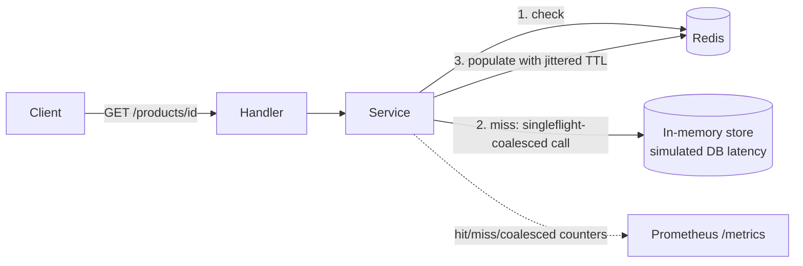

# Cache-Aside Product Catalog

A product catalog API in Go that caches reads in Redis instead of hitting the database on every request. Built to prove I actually understand caching in production, not just that I can call `redis.Get()`.

## The problem

Once an API gets enough traffic, hitting the database on every single read stops working: the database becomes the bottleneck, and it's usually the most expensive thing to scale. The standard fix is to put a cache in front of it. That sounds simple, but a naive cache introduces two bugs that only show up under real load, and I wanted a project that actually has these bugs and actually fixes them, not just a `GET`/`SET` wrapper around Redis.

1. **Cache stampede (a.k.a. thundering herd).** Say a product page goes cold in the cache: nobody's viewed it in a while, so it expired. Now 500 people click it in the same second. A naive cache-aside implementation sends all 500 requests straight to the database at once, because none of them found anything in the cache yet and none of them know the other 499 are doing the exact same thing. The database gets hit with 500x the load it should, for one page.
2. **Synchronized expiry.** If a batch of cache entries all get written around the same time with the same TTL (say, "cache for 30 seconds"), they all expire at the same moment too. That recreates the stampede problem, except now it happens automatically, on a timer, forever: a self-inflicted spike every 30 seconds.

## What I built

A small catalog service (`GET/POST/PUT /products`) where reads go through a cache-aside layer in front of a datastore:

- On a read, check Redis first. If it's there, return it (cache **hit**).
- If it's not there (cache **miss**), fetch from the datastore, write the result into Redis, then return it.
- On a write, update the datastore and delete the cache entry for that item, instead of trying to update the cached copy in place.

That part alone is the "textbook" cache-aside pattern. The two things I actually built to solve the real bugs above:

- **Stampede protection**, using Go's `singleflight` package. When multiple concurrent requests miss the cache for the *same key at the same time*, only the first one actually calls the datastore. The rest just wait for that first call to finish and share its result. I proved this works with a test that fires 50 concurrent requests at one cold key and asserts the datastore was only called once, not 50 times.
- **Jittered TTL.** Instead of giving every cache entry the exact same expiry time, I add a random amount on top of the base TTL (e.g. base 30s plus up to 10s random). That spreads expirations out over time instead of letting a batch of entries all die at once.

## Why I made each choice the way I did

**Cache-aside over write-through.** There are a few standard caching patterns (cache-aside, write-through, write-behind). I picked cache-aside because it matches this workload: mostly reads, occasional writes, and the cache doesn't need to always be warm. It's fine for it to be empty and fill up on demand. It's also the pattern most real backend systems reach for first for this shape of problem.

**Redis over an in-process cache.** Go has in-process caching libraries that don't need any external service. I didn't use one, on purpose: an in-process cache only helps a single instance of your service. The moment you run more than one replica, which any real production deployment does, each replica has its own separate cache, and you lose most of the benefit. Redis is shared across replicas, which is the actual production shape of this problem.

**`singleflight` over a distributed lock.** To stop concurrent misses from all hitting the datastore, I could have implemented a distributed lock in Redis (e.g. `SETNX`) so only one process-wide request proceeds while others wait. I used Go's `singleflight` package instead because it solves the problem entirely in-process with a few lines of well-tested standard-adjacent code, and it's easy to reason about and test without needing a second Redis round-trip just to coordinate the lock. The honest limitation: `singleflight` only coalesces requests within one running instance of the service. If this were deployed as 5 replicas behind a load balancer, each replica could still send its own single request to the datastore at the same moment, so at scale you'd see up to 5 stampede requests instead of 500, not 1. Fixing that fully needs a cross-instance mechanism (a distributed lock, or a "probabilistic early expiration" strategy where cache entries refresh themselves slightly before they actually expire). I chose not to build that here because it adds a lot of complexity for a demo project, but the limitation is real and worth knowing.

**An in-memory store instead of a real Postgres database.** The datastore behind the cache is an in-process map with artificial latency added (`internal/store/memory.go`), not a real database. I did this deliberately: this project is about the caching layer, not about running a database. Using an in-memory store means the whole demo only needs one real dependency (Redis) instead of two, so anyone can run it with a single `docker compose up`. The store sits behind a `Store` interface, so swapping in a real Postgres implementation later is a contained change. It wouldn't touch the caching logic at all, because the caching logic only ever talks to the interface.

**Go 1.22+'s built-in HTTP routing instead of a router library.** Recent Go versions added pattern matching like `"GET /products/{id}"` directly to the standard library's `http.ServeMux`. For a handful of routes, pulling in a third-party router (like `chi`) would just be an extra dependency doing something the standard library now does on its own.

**Prometheus metrics instead of just log lines.** I track three counters: cache hits, cache misses, and store calls that got coalesced by `singleflight`. These aren't decoration, they're how the end-to-end simulation script *proves* the stampede protection actually worked, by reading the coalesced-call counter before and after firing 50 concurrent requests, instead of just trusting the code is correct.

**A Go-based load generator instead of a tool like `hey` or `k6`.** The simulation needed to do more than just fire requests and measure latency. It needed to read the Prometheus metrics endpoint before and after each phase and assert on the numbers (e.g. "coalesced count increased by exactly 49"). That's easier to write as a small Go program than to bolt onto an existing load-testing tool, and it means the only thing anyone needs installed to run the whole demo is Go and Docker, no extra CLI tools.

## Architecture



## Endpoints

| Method | Path | Behavior |
|---|---|---|
| `GET` | `/products` | List all products (bypasses cache, see Limitations) |
| `GET` | `/products/{id}` | Cache-aside read |
| `POST` | `/products` | Create a product |
| `PUT` | `/products/{id}` | Update a product, invalidates its cache entry |
| `GET` | `/healthz` | Liveness check |
| `GET` | `/metrics` | Prometheus metrics |

## Running it

```bash
make up         # docker compose up -d --build (starts Redis + the app)
make simulate    # runs the end-to-end simulation against the running stack
make down        # tears everything down
```

`make simulate` runs `cmd/simulate`, which does four things against the real, running stack over HTTP, not against mocks:

1. Waits for `/healthz` to come up.
2. Creates one product, then fires 50 concurrent `GET`s at it while it's still a cold cache entry, then checks `/metrics` to confirm 49 of those 50 requests were coalesced by `singleflight` rather than hitting the store.
3. Seeds a small catalog and runs a read-heavy workload across it, then reports the resulting cache hit ratio from `/metrics`.
4. Updates a product and immediately re-reads it, to confirm the cache was invalidated and the new value comes back.

CI runs this same flow automatically on every push (see below), so it's verified even without Docker installed locally.

## Testing

`make test` runs the unit test suite (`internal/catalog/service_test.go`), which uses an in-process fake Redis (`miniredis`) so it runs in about a second with no external dependencies:

- **Miss then hit**: first read hits the store, second read is served from cache, store isn't called again.
- **Not found**: a missing product returns an error instead of a false cache entry.
- **Stampede protection**: 50 concurrent reads of the same cold key result in exactly 1 store call, verified with a counting wrapper around the store.
- **Update invalidates cache**: updating a product forces the next read to be a genuine miss that returns the new value, instead of serving a stale cached copy.

## CI

`.github/workflows/ci.yml` runs on every push and pull request:

- `build-test`: builds, vets, and runs the unit tests with the race detector.
- `docker-build`: builds the Docker image.
- `e2e`: runs the real `docker compose` stack (Redis plus the app) and runs `scripts/simulate.sh` against it, the same command described above under Running it. This is what actually proves the containerized stack works end to end, since GitHub's runners have Docker preinstalled and my local machine doesn't.

## Known limitations (things I'd change for a real production system)

- `singleflight` protection is per-instance, not cross-instance. Explained above, under "singleflight over a distributed lock."
- The datastore is an in-memory stand-in with fake latency, not a real database. Explained above, under "an in-memory store instead of a real Postgres database."
- `GET /products` (list) intentionally bypasses the cache. Caching a list endpoint invites its own problems (pagination, invalidating the list on every single product write), which is a different problem than the one this project is about.
- No authentication on the API. Out of scope for what this project is demonstrating.
- Product data doesn't persist across restarts, since the store is in-memory. Not a problem for this demo, would matter immediately with a real database.
